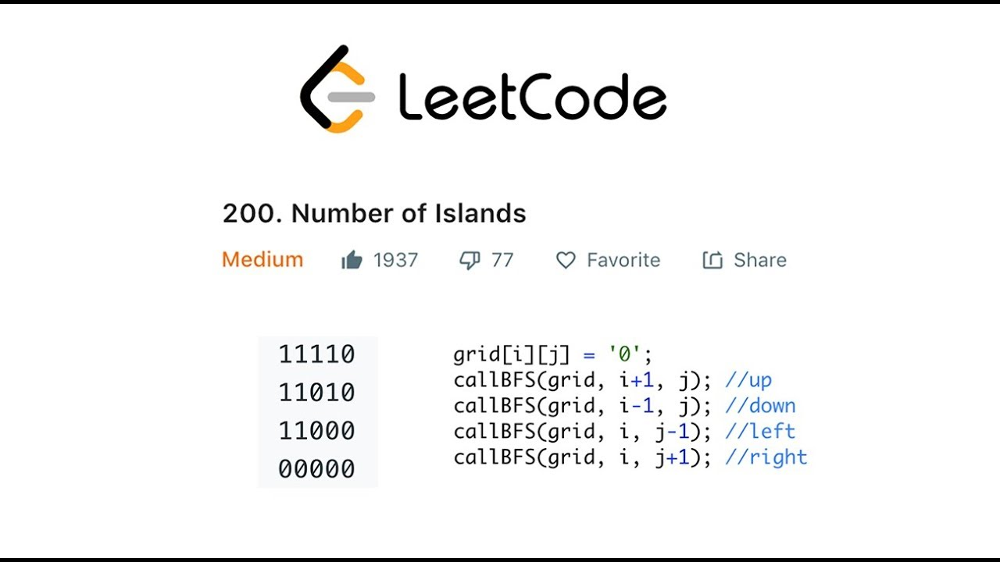

# C++ Algorithms

This repository contains lots of algorithm implementations and problems solution from multiple sources.

Codes of algorithm implementations and problems solutions are organized as branches.

## Detail

### A. Branch: ZCY

Branch ZCY contains codes and problems of courses provided by Chengyun Zuo from: [bilibili video](https://www.bilibili.com/video/BV13g41157hK?p=1&vd_source=a46a785ab89c09f0998d1f3ad010a333)

### B. Branch: LeetCode

Branch LeetCode contains solutions of leetcode problems.

